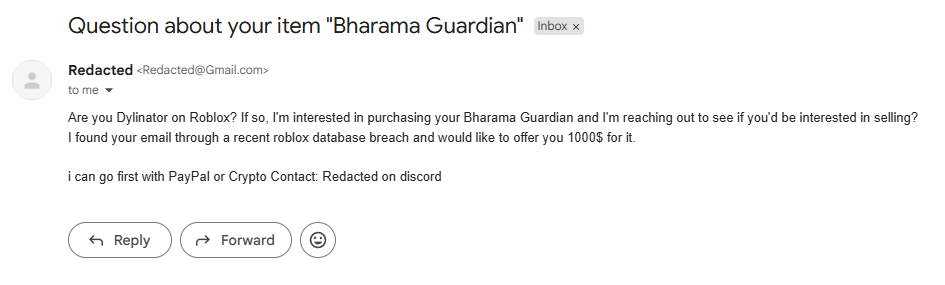

---
tags:
  - info
  - trading
  - roblox
title: Deceptive Users targets users by email to sell items for way below market value
author: Rolimon's Community
pubDate: 2026-02-17
---
Previous data breaches may have left your email vulnerable to people looking to buy limited items for crypto, Robux, or even PayPal transactions. They mainly target older traders and collectors that may not know what their items go for and then offer a significantly lower value than what they go for, either through email or discord.

While some people maliciously/Deceptively offer low offers in the hopes of them not knowing what it’s worth many also use email to offer genuine offers as well that are fair for both parties so we’re going to classify this post more so as informational then a scam.

Be sure to always be up to date on what your items go for and what they're valued at and talk with friends or trusted people before selling your items.

