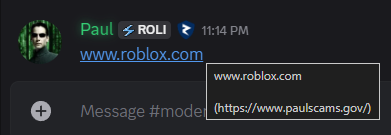

---
tags:
  - discord
  - steam
  - malware
  - phishing
title: Discord/Steam Giftcard Scam
author: Rolimon's Community
pubDate: 2026-02-19
---

You may see a message or get a direct message from someone offering to give you a free Steam gift card but they may use other brand names such as Amazon. You may think you hit the jackpot, but in reality, they are sending you a masked link that takes you to a malicious website, where they then harvest your login information and use it to turn you into a bot that DMs all your friends and every server the same message.

You can avoid this by checking what links are by hovering over them to make sure you're going to the real website, and always remember that if it's too good to be true, it's a scam. This can also happen if you download pirated copies of games off of websites or download other sketchy programs such as Roblox exploits.

