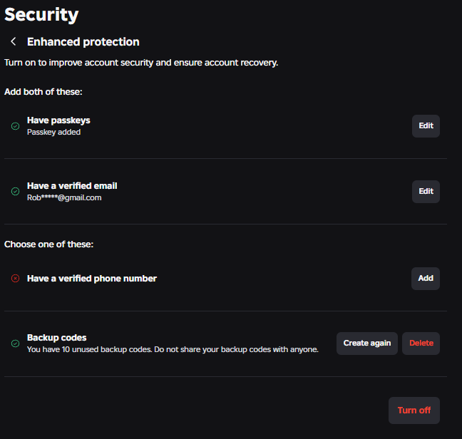
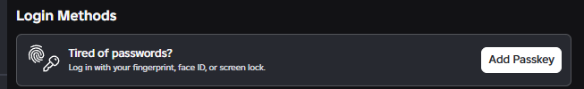

---
tags:
  - info
  - roblox
title: Enabling Enhanced Protection on your Roblox Account
author: Rolimon's Community
pubDate: 2026-05-12
---

Roblox has recently rolled out Enhanced Protection to all users. This makes it so that people can no longer sign in directly with your password or email on your Roblox account. Instead, they will need a security key or passkey to complete the action or any other risky move on your account, like trading items or transferring groups.

The requirements are to have a **Verified** email and a **Passkey** as well as the option between either saving your Backup codes or adding a phone number. For passkeys you can use any widely available options such as Face ID or Fingerprint and you can also add a physical security key as well.

**MAKE SURE TO WRITE YOUR BACKUP CODES PHYSICALLY AND KEEP THEM SOMEWHERE SAFE** If your computer is hijacked, they can use this to disable your two step verification if they have your email. If you do not add your phone number, Roblox will be unable to remove the protection from your account if you lose your passkey and are unable to log in.

You can read Roblox's annoucement on enhanced protection here: https://devforum.roblox.com/t/introducing-enhanced-protection-professional-grade-security-for-creators/4589347