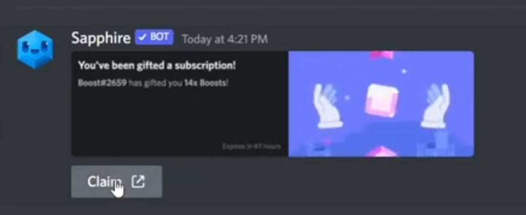

---
tags:
  - discord
  - scam
  - phishing
title: Fake Discord Nitro Giveaway/Gift
author: Rolimon's Community
pubDate: 2026-02-19
---

You get a DM from a bot that looks like you just won or got gifted free Nitro from a user. You might think it's your lucky day, but there are a few malicious bots that when you click on the gift link or the claim button underneath the embed it will ask you to authorize a bot onto your account. Normally the scammers use this to place you into a bunch of other scam servers to boost members and look professional, but some may also lead you to malicious websites where they then trick you into logging in with your information and giving them access to your account.

You can avoid this by always checking that the gift you received is legitimate, hovering over links to make sure they are not masked, and verifying they are real.

