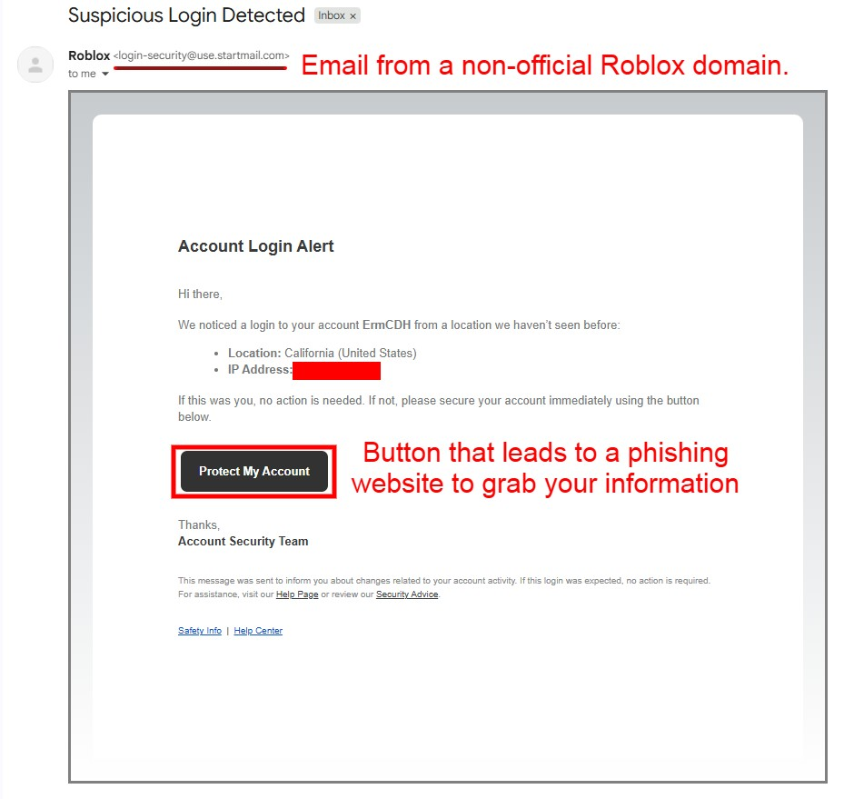

---
tags:
  - scam
  - email
  - phishing
title: Fake Emails
author: Rolimon's Community
pubDate: 2025-08-01
---

This scam involves a fake email account impersonating a Roblox support email. They send you a phishing email to socially engineer you into thinking somebody is accessing your account. If you click the "protect my account" button, you will be redirected to a phishing site, likely resulting in your account being stolen or your credentials harvested. Always ensure the email is from an official Roblox account.

