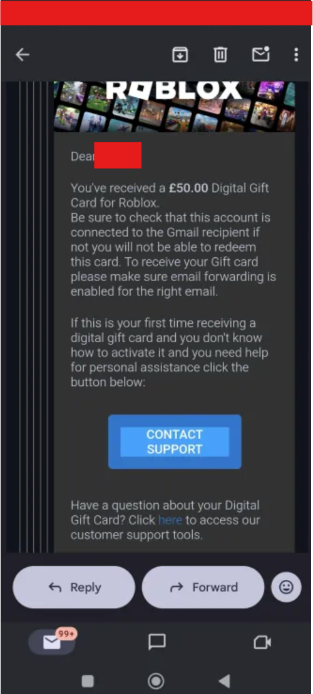
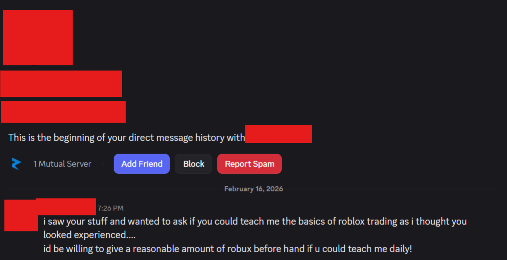

---
tags:
  - roblox
  - email
  - trading
  - discord
  - phishing
title: Fake Giftcard Email Scam (Trade Help Scam)
author: Rolimon's Community
pubDate: 2026-02-18
---

A user will approach you and ask for trade help and in return for helping them, they will offer to send a CashStar Roblox gift card to your email address. What they send you will not be an official email but rather a scam email that will trick you into forwarding all future emails to their own, giving them access to receive password resets and allowing them to take control over your account. They may also try to phish you in other ways, such as fake bookmarks, cookie logging, or any other scams listed in this channel.

Never accept free gift cards from people you don't know. If it's too good to be true, then it's likely a scam.

