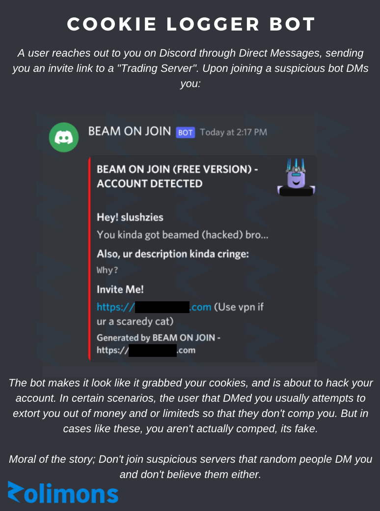

---
tags:
  - scam
  - bot
  - discord
title: Fake Malicious Bots
author: Rolimon's Community
pubDate: 2025-08-12
---
A random user invites you to a "trading server" in your DMs, and upon joining, you notice that a particular bot has DM'd you. It tells you that you have been hacked and your cookies have been stolen.
  
This is an attempt by the inviter to socially engineer and extort you out of anything you have so that they don't hack you. Don't believe what random people tell you on Discord , and avoid joining suspicious servers sent by untrusted individuals.

Image Below:
