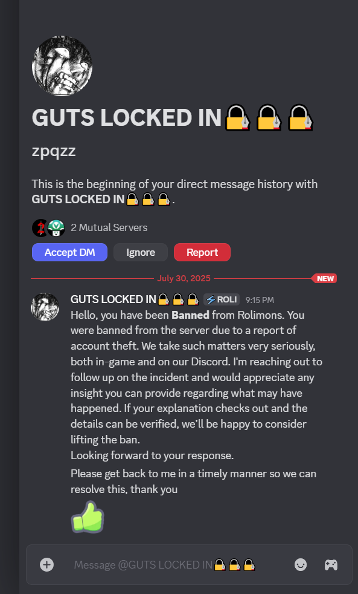

---
tags:
  - discord
  - scam
  - roblox
  - trading
title: Fake Rolimon's Staff Scam
author: Rolimon's Community
pubDate: 2025-08-20
---
_Programmer's Note: For context, this post was made in the Rolimon's community Discord server, but the overall message should apply to all Discord servers._

In this scam, a user will try to get you banned from the a Rolimon's server by faking evidence. (We try to prevent this as much as we can, but unfortunately, it can still happen.) After they get you banned, they DM you from an account that looks like a moderator, but it is not. They then normally proceed to ask you to join a call and attempt to pull the ⁠[Screen Share Scam](</posts/screen-share-scam>) on you.

Please note that no Rolimon's moderator will ever reach out to you regarding a ban. We have a support server with a ticket system to help you. The only times we reach out to users is if we need more information on serious or illegal cases reported to us.

