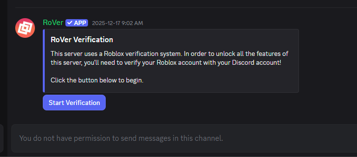
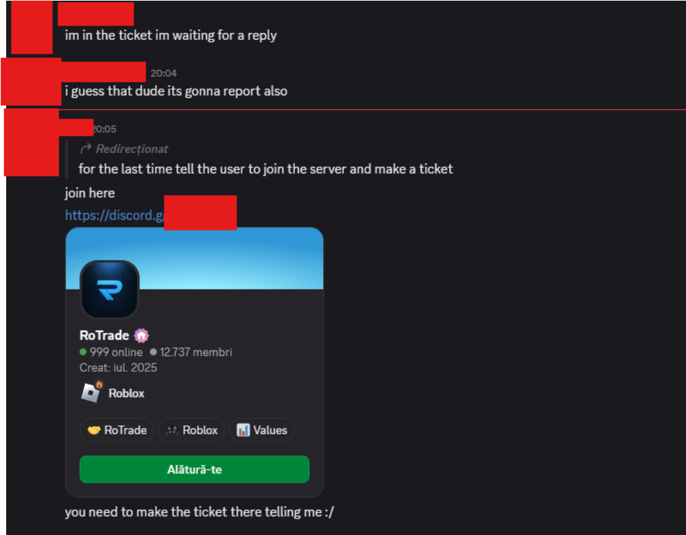

---
tags:
  - roblox
  - trading
  - discord
  - phishing
title: Fake Rotrade/Rblxtrade Server (Social Engineering)
author: Rolimon's Community
pubDate: 2025-12-23
---
Using the same strategy as ⁠[Fake Malicious Bots](</posts/fake-malicious-bots>) people use a fake Discord server disguised as former places such as Rblxtrade or Rotrade to lure people into DMs with fake messages that look like you are being impersonated and asking to be terminated or bragging about scamming. Once you are in the server you are greeted by a verification channel with a fake Rover bot, where you then have to log in with your information. This is malicious, and after you send them the information, you will lose access to your account and limited items.

Rolimon's does not endorse or support any third-party trading servers, and for your protection, we recommend discussing all things trading here or on our group wall. If you encounter something suspicious, don't hesitate to contact a staff member to confirm whether it is real or not.

