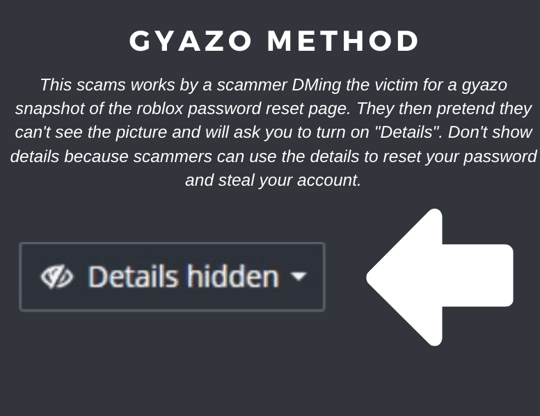

---
tags:
  - scam
  - roblox
title: Gyazo Scam
author: Rolimon's Community
pubDate: 2025-08-12
---
This scam involves a scammer DMing the victim for a Gyazo snapshot of the Roblox password reset page. They then pretend they can't see the picture and will ask you to turn on "Details." This option will give the scammer the ability to see where the picture was taken, and they can visit the password reset link to access your account.

