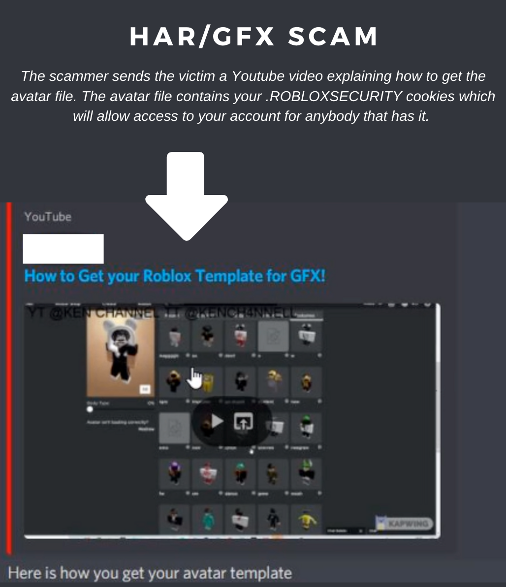

---
tags:
  - roblox
  - scam
title: HAR/GFX Scam
author: Rolimon's Community
pubDate: 2025-08-01
---

This method of scamming involves a user DMing the victim, telling them that they can make a free GFX from their avatar or use it in a thumbnail. They ask for your avatar file and send you a video tutorial, but in reality, if you send someone your HAR file or avatar file, you give them access to your account, as they contain your .ROBLOXSECURITY cookies.

