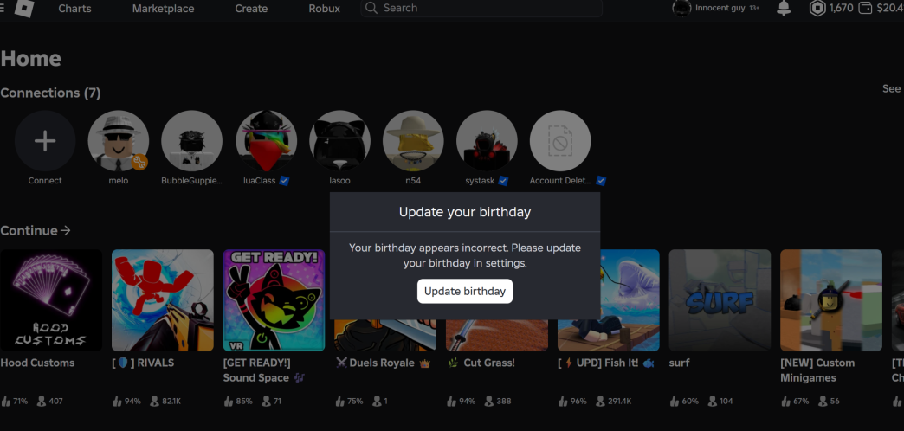

---
tags:
  - browser
  - roblox
  - malware
title: Malicious Extension
author: Rolimon's Community
pubDate: 2025-11-14
---

Many malicious extensions appear in areas like the Firefox and Microsoft Edge extension stores that are harmful. They disguise themselves as extensions for certain features like searching for people with their joins off to deceive users or even copy more notable extensions like Roblox+, Rovalk, or Ropro. While Rolimon's does not endorse any third party Roblox extensions or have its own we advise you to be cautious when installing these and ensure you install the right ones from the proper channels.

These extensions usually prompt you to update your birthday and ask for your two-step verification code. After you put it into Roblox, it then gives them the ability to steal your limited items, Robux, and even your entire account.

