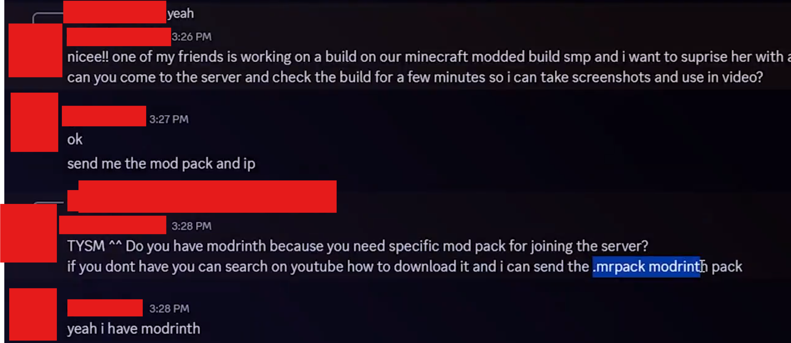

---
tags:
  - malware
  - minecraft
  - discord
title: Malicious Minecraft Resource Pack/Mod leads to Account Compromise
author: Rolimon's Community
pubDate: 2026-05-19
---

Similar to the [Terraria TModLoader Virus](</posts/terraria-tmodloader-virus>) an user DMs you on Discord asking if you'd like to either play Minecraft or help with a Minecraft server. They will ask you to download either a resource pack or a mod manager like Modrinth or Lunar Client and install a malicious mod that gives the attacker access to your computer (Remote Access Trojan).

These people will either DM you on Discord out of the blue or even go as far as to impersonate a friend to lure you into clicking a link. They will wait until you try to complete a trade or perform an action on your account that requires two-step verification, and then they will take all of your Limited's and your account.

