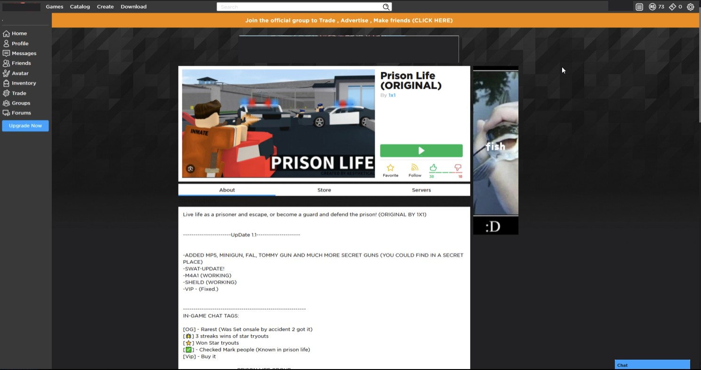

---
tags:
  - info
  - roblox
  - malware
title: Malicious Old Roblox Revivals
author: Rolimon's Community
pubDate: 2025-08-31
---
There are sites that pop up every now and then that run modified classic versions of the Roblox website and client to try to capture a nostalgic feeling. Most of the time, the internals of these websites are not secured properly and historically collect user information to sell, leak, or use, such as usernames and passwords, or run files in the background to potentially RAT you, giving them the ability to do many things, such as key log you.

Never sign up for random classic Roblox revivals and download custom launchers, as it is dangerous and could lead to your items being stolen.

