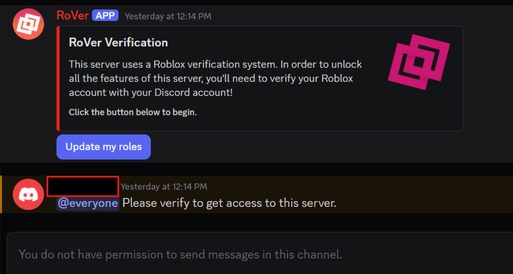
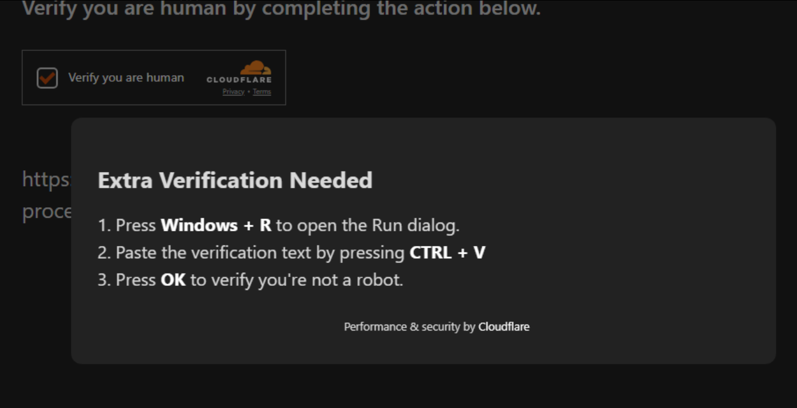
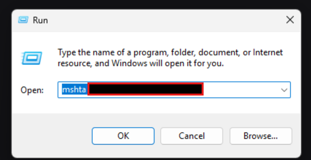

---
tags:
  - roblox
  - scam
  - trading
title: Malicious Verification Bot RAT
author: Rolimon's Community
pubDate: 2026-02-26
---
A malicious Rover bot has been making its way around the Roblox community recently, normally inside fake Rolimon's or other fake trading servers. At first glance, it closely resembles the "Update my roles" feature that appears with Rover when you join a server, but when you click on it, you are directed towards a fake Cloudflare verification that asks you to do extra steps by opening the run window and copy and pasting what's inside and clicking "ok" By doing this you are installing a RAT onto your computer and giving them full control over it and everything you are logged into. 

Do not **EVER** Run things in the run window that are from other users, as there is a 100% chance they are trying to scam you. Rolimons Staff, Bloxlink, Rover, or absolutely any legitimate Roblox service will **NEVER** ask you to run something inside your run bar.

**!!! The following images are for educational purposes only, do not attempt to recreate them or you will risk your account getting compromised !!!**

