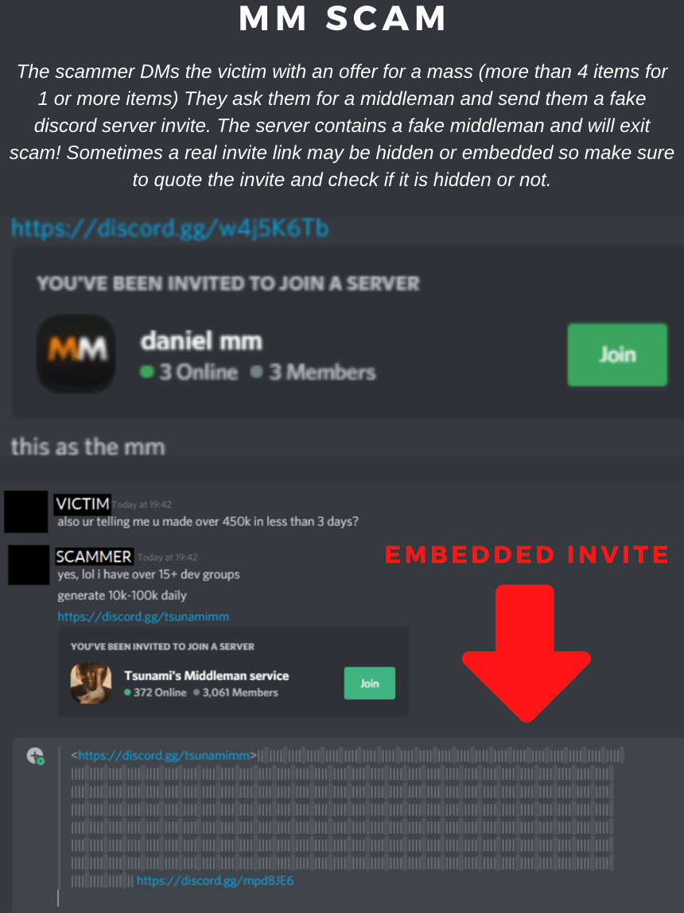

---
tags:
  - roblox
  - scam
  - trading
title: Cookie Logging and Phishing Sites
author: Rolimon's Community
pubDate: 2025-08-01
---
This type of scam can occur in many different ways, where a user may send you a fake Discord MM-server invite (sometimes it's embedded), may pretend to be a known and trusted middleman, or they may let you into a group chat with a real MM and then swap them out for a fake one, making you send your items to an alt. Double-check all users who may be impersonating others, and also verify invites and ask around for help.

Image Below:
