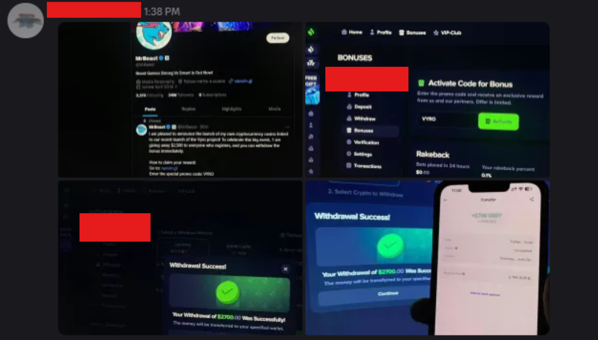

---
tags:
  - steam
  - discord
  - scam
title: Mr Beast / Crypto Scam
author: Rolimon's Community
pubDate: 2026-02-19
---

A user will post a message either in DMs or in a channel like Lounge, featuring an announcement from a famous influencer (typically MrBeast) that includes a tweet advertising a new crypto casino or coin, along with images displaying insane cash rewards.

No, MrBeast is not running a casino. The users who send these messages are compromised by clicking a link, visiting a sketchy site, and inputting information or even downloading sketchy programs that turn their account into a bot that posts these messages in every DM and server they have. You can avoid this scam by following the golden rule. If it's too good to be true, then it's likely a scam.

