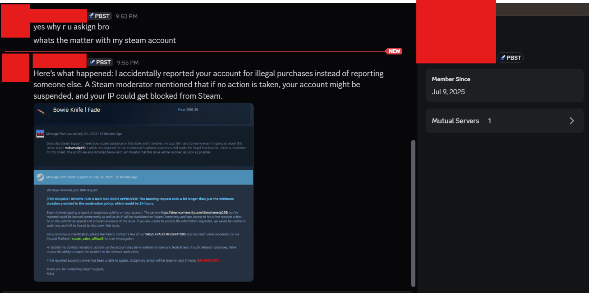
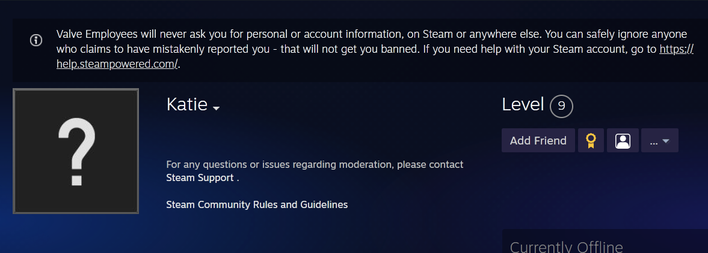

---
tags:
  - steam
  - discord
  - scam
title: Steam Support Scam
author: Rolimon's Community
pubDate: 2026-12-05
---
A user will DM you on either Discord or Steam in an urgent matter. They will claim that they have reported you and had their friends report you, and that your Steam account is now at risk of getting banned unless you contact a Valve employee. 

They use a sense of urgency to push you into DMing a malicious actor on Discord, to which they then proceed to try and steal your account. Valve employees will never contact you or ask you to contact them directly off platform. Any contact will be done on platform through Steam Support.

There is also a disclaimer about this on any valve employees profile.

