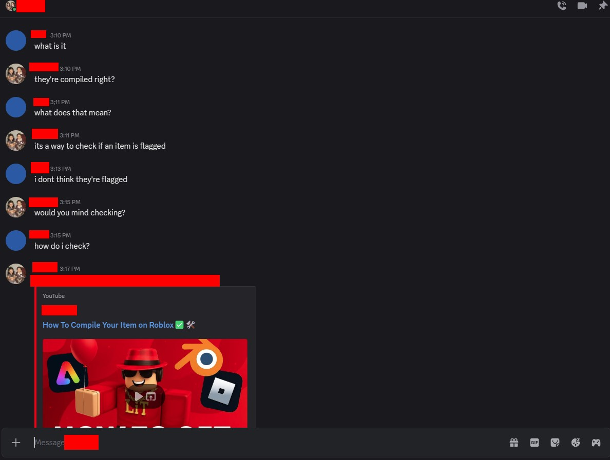
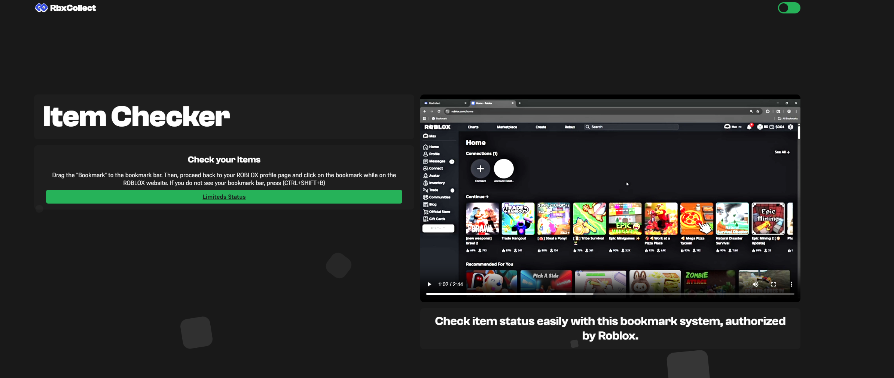

---
tags:
  - scam
  - roblox
  - trading
  - discord
title: Trade-API/Item Status/Poison Checker/Compiler Scam
author: Rolimon's Community
pubDate: 2025-08-20
---
This scam has many names, such as Trade-API, Item Status, and Poison Checker Scam, but its most recent name is the Item Compiler.

A user DMs you on Discord looking to trade, offers you a trade too good to be true, and then asks if your item is poisoned. They then ask you to watch a video that tells you to copy the PowerShell of a folder in your network tab in Inspect Element and run it through their website to check if your item is clean.

Do not share anything from the Inspect Element page with another user, and By sending your network folder, you are also sending them all your cookies for that session, giving them access to your Roblox account through the roblosecurity cookie.

**THERE IS NO SUCH THING AS AN ITEM STATUS/POISON CHECKER OR COMPILER OR ANY TOOLS PROVIDED BY ROBLOX OR ROLIMONS**

Image Below:

A new version of this scam called RbxCollect is making its rounds. In this scam the perpetrators ask you to check your items on a website and then trick you into adding a malicious bookmark to your Chrome browser to harvest your credentials and then likely will use your account to spread it.

