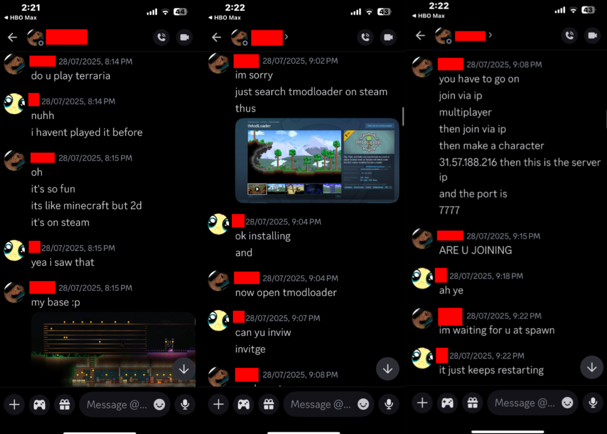

---
tags:
  - malware
  - terraria
  - discord
title: Terraria TModLoader Virus
author: Rolimon's Community
pubDate: 2025-08-20
---
A user DMs you on either Roblox (and quickly takes your conversation off-platform) or contacts you on Discord. They usually say they are lonely or don't have friends and ask if you want to play on a modded Terraria server using TModLoader. The mods they have automatically install on your computer, including their own malicious one that installs a remote access trojan (RAT) on your computer, giving them access to both your entire computer and limiteds.

Example below:

